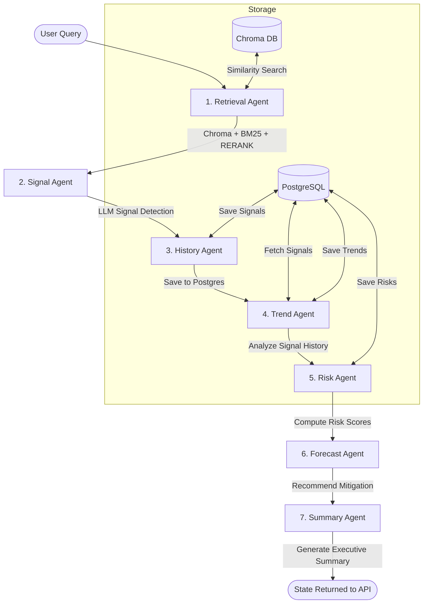
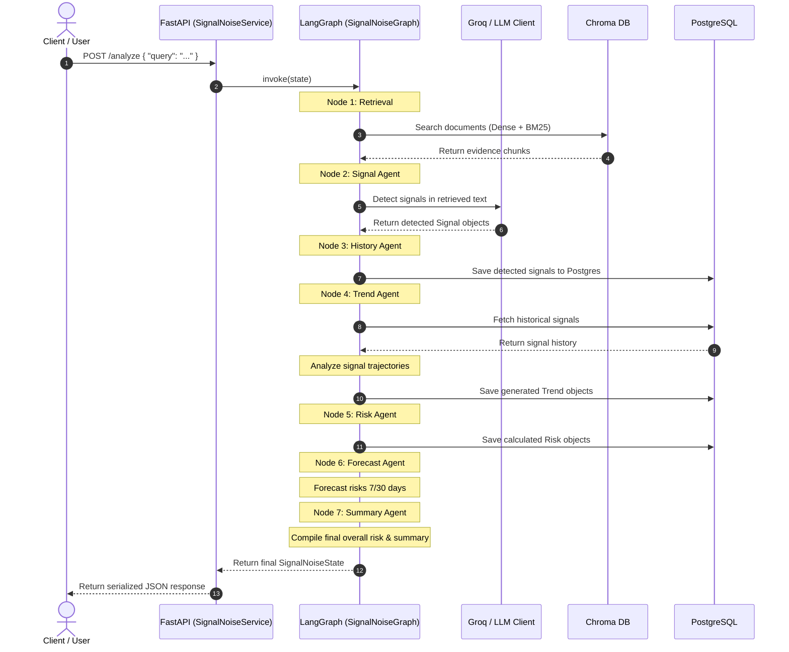

# SignalNoise AI

SignalNoise AI is an enterprise-grade AI platform designed to surface weak signals, bottlenecks, risks, and trends hidden in organizational communications (meeting notes, documents, transcripts). 

The platform utilizes a hybrid RAG (Retrieval-Augmented Generation) pipeline coupled with a LangGraph state machine orchestrating multiple specialized agents to analyze and predict risks.

---

## 🏗️ System Architecture

The application is split into three primary layers:
1. **API Layer (FastAPI)**: Serves endpoints for user interactions, document ingestion, and metrics collection.
2. **Agentic Orchestration Layer (LangGraph)**: Manages query flow across 7 specialized nodes to build an analysis state.
3. **Storage & Database Layer (PostgreSQL & Chroma DB)**: Stores structural history (signals, trends, risks) and vector representations of documents.

### 🔄 Data Flow (LangGraph Pipeline)



### ⏱️ Sequence Diagram



---

## 🛠️ Component Overview

### 1. Ingestion & Retrieval (RAG)
* **Ingestion**: Supports reading `.txt`, `.pdf`, `.docx` through a central factory.
* **Vector Store**: Embeds documents using standard HuggingFace embeddings (`BAAI/bge-small-en-v1.5`) and stores them inside a local Chroma collection.
* **Hybrid Retrieval**: Queries are executed in parallel across `DenseRetriever` (vector similarity) and `SparseRetriever` (BM25 keyword search), fused using RRF (Reciprocal Rank Fusion) and reranked for maximal relevance.

### 2. Specialized Agents
* **Retrieval Agent**: Fetches the top relevant evidence chunks.
* **Signal Agent**: Employs an LLM detector to analyze text blocks and extract structured `Signal` models.
* **History Agent**: Persists detected signals in PostgreSQL.
* **Trend Agent**: Uses a `TrendAnalyzer` over historical signals to identify growth rates and stable/volatile patterns.
* **Risk Agent**: Computes mathematical risk scores based on trend momentum, signal count, and severity.
* **Forecast Agent**: Calculates future risk probabilities (7 and 30 days) and generates tactical recommendations.
* **Summary Agent**: Evaluates the worst risks and builds a clean `ExecutiveSummary`.

### 3. Centralized Settings & Logging
* **Settings**: Managed via `pydantic-settings` to load, type-check, and freeze configurations from `.env` files. Includes a computed property `database_url`.
* **Central Logger**: Exported from `observability/logger.py` to print structured console logs with level, timestamp, and originating module context.

---

## 🚀 Getting Started

### Prerequisites
* Python `3.11` (managed easily with [uv](https://github.com/astral-sh/uv))
* Docker & Docker Compose

### Environment Setup
Create a `.env` file in the root of the project with the following configuration:

```env
MODEL_NAME=BAAI/bge-small-en-v1.5
GROQ_MODEL_NAME=llama-3.3-70b-versatile
GROQ_TEMPERATURE=0.7
GROQ_API_KEY=your_groq_api_key
LANGCHAIN_API_KEY=your_langsmith_api_key
LANGCHAIN_TRACING_V2=true
LANGCHAIN_PROJECT=SignalNoiseAI
POSTGRES_HOST=localhost
POSTGRES_PORT=5432
POSTGRES_DB=signalnoise
POSTGRES_USER=postgres
POSTGRES_PASSWORD=postgres
```

### Running Locally

1. **Install Dependencies**:
   ```bash
   uv sync
   ```
2. **Start PostgreSQL Container**:
   ```bash
   docker compose up -d postgres
   ```
3. **Launch the API Server**:
   ```bash
   uv run uvicorn --app-dir src signalnoise.api.main:app --reload
   ```
4. **Access the API Docs**:
   Open [http://localhost:8000/docs](http://localhost:8000/docs) in your browser.

---

## 🐳 Docker Deployment

The application is containerized with an optimized multi-stage cache build.

To stand up the complete stack (FastAPI server + PostgreSQL db):
```bash
docker compose up --build
```
This boots:
* **`signalnoise-postgres`** on port `5432`
* **`signalnoise-api`** (FastAPI app) on port `8000`

---

## 🧪 Testing

The project includes unit, integration, and E2E smoke tests.

To run all tests:
```bash
uv run pytest
```

Specific test highlights:
* **E2E API Test** ([tests/test_api_e2e.py](file:///c:/Users/Admin/signalnoise-ai/tests/test_api_e2e.py)): Tests database operations, Chroma retrieval, agent state mutations, and outputs the final execution summary json format.
* **Logger Test** ([tests/test_logger.py](file:///c:/Users/Admin/signalnoise-ai/tests/test_logger.py)): Verifies centralized stdout log formats.
